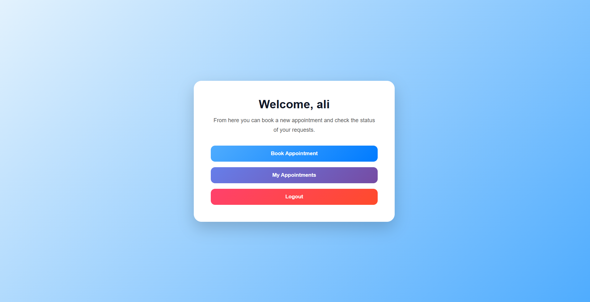
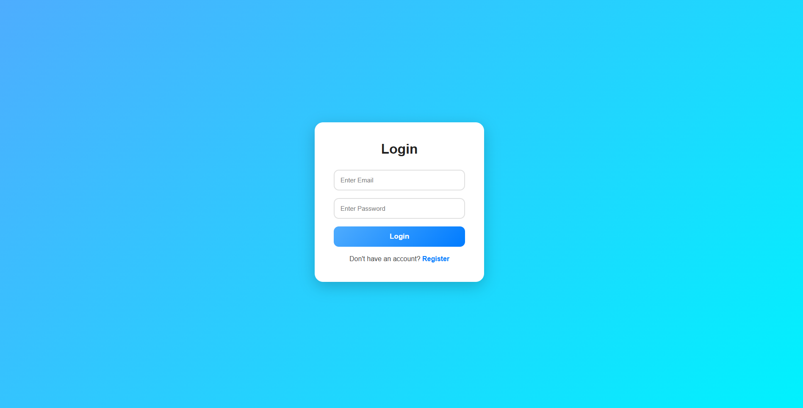
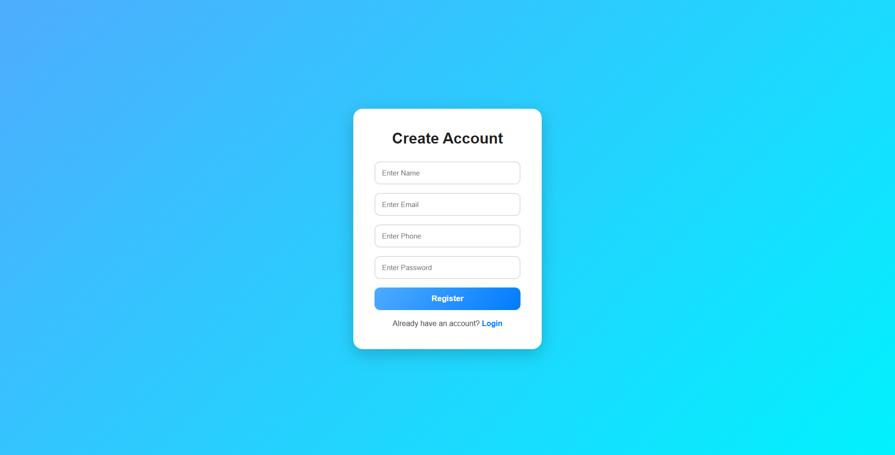
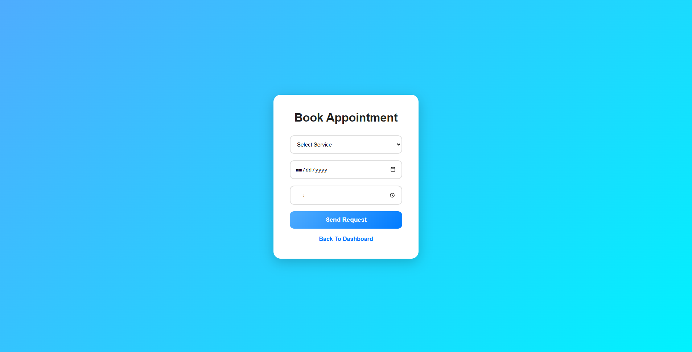
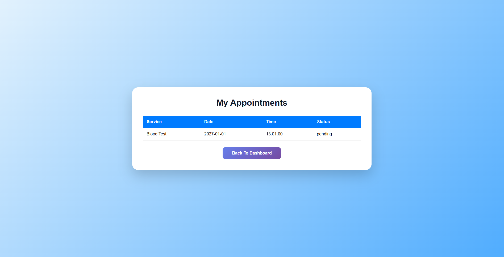
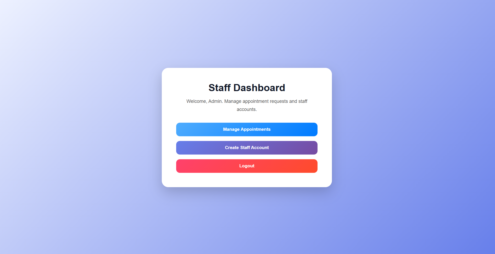
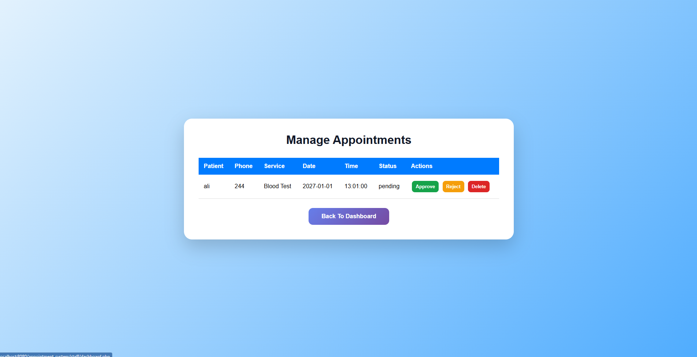
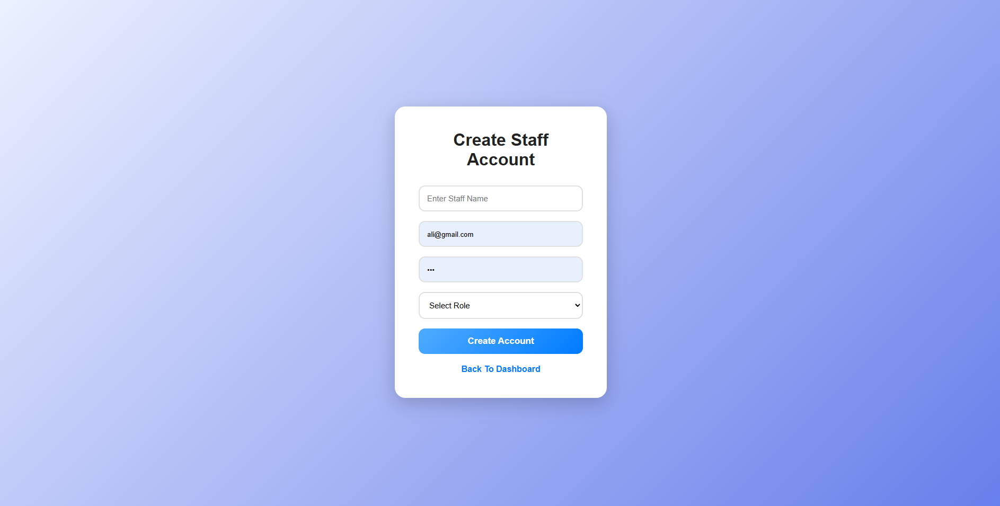

# 📅 Appointment Booking System

A web-based Appointment Booking System developed using **PHP, MySQL, HTML, CSS, and JavaScript**.  
The system allows users to create accounts, book services, track their appointments, while staff members can log in, view appointments, and accept or manage bookings.

---

## ✨ Features

- 🔐 User & Staff Login
- 👤 User Registration
- 🧑‍💼 Staff Dashboard
- 📋 Services List
- 📅 Book Appointments
- 🕒 View My Appointments
- ✅ Staff Appointment Approval
- 📝 Staff Notes
- 💾 MySQL Database Integration
- 📱 Responsive Interface

---

## 🛠 Technologies Used

- PHP
- MySQL
- HTML5
- CSS3
- JavaScript
- SQL

---

# 🧭 System Pages Explanation

## 🏠 Home Page

The main landing page of the system.  
It introduces the appointment booking system and provides navigation links to login, register, services, and other system pages.

---

## 🔐 Login Page

This page is used by both **users** and **staff**.

The login system first checks if the entered email and password exist in the **staff** table.  
If the account exists in the staff table, the system redirects the user to the staff dashboard.

If the account is not found in the staff table, the system then checks the **users** table.  
If the account exists in the users table, the system redirects the user to the user dashboard.

So, the same login page works for both account types.

---

## 👤 Register Page

This page allows normal users to create a new account.  
The registered user data is stored in the **users** table.

Staff accounts are not created from the public registration page.  
They should be added directly by the administrator or inserted into the **staff** table.

---

## 📊 User Dashboard

After a normal user logs in, they are redirected to the user dashboard.  
From this page, the user can browse services, book appointments, and view their own appointments.

---

## 📋 Services Page

This page displays the available services stored in the **services** table.  
Each service includes information such as service name, description, price, and duration.

---

## 📅 Book Appointment Page

This page allows users to select a service, choose an appointment date and time, and submit a booking request.

When the user books an appointment, the appointment is stored in the **appointments** table with a default status such as `pending`.

---

## 🕒 My Appointments Page

This page displays the appointments booked by the logged-in user.  
The user can view the service name, appointment date, appointment time, and current status.

For example, the status may be:

- Pending
- Accepted
- Rejected
- Completed

---

## 🧑‍💼 Staff Dashboard

This page is only for staff accounts.  
Staff members can view appointment requests submitted by users.

The staff can review appointments and update their status, such as accepting or rejecting the appointment.

---

## ✅ Staff Appointment Approval

Staff members manage appointment requests from their dashboard.  
When staff accepts an appointment, the status changes from `pending` to `accepted`.

This allows users to know whether their booking has been approved.

---

## 📝 Staff Notes

Staff can add notes related to an appointment.  
These notes may include instructions, comments, or updates about the appointment.

---

# 📸 Screenshots

## 🏠 User Dashboard

The main page displayed after a user logs in.



---

## 🔐 Login

Shared login page for both users and staff.



---

## 👤 User Registration

Create a new user account.



---

## 📅 Book Appointment

Users can choose a service, date, and time to submit a booking request.



---

## 🕒 My Appointments

Displays all appointments booked by the logged-in user along with their current status.



---

## 🧑‍💼 Staff Dashboard

The main dashboard for staff members after logging in.



---

## ✅ Manage Appointments

Staff can review appointment requests, approve or reject them, and update appointment status.



---

## ➕ Create Staff

Allows adding new staff members to the system.


---

# 🚀 How to Run

1. Clone or download the repository.
2. Copy the project folder into the **htdocs** directory.
3. Create a database named:

```sql
appointment_system
```

4. Import the SQL file if available, or create the required tables manually.
5. Start **Apache** and **MySQL** using XAMPP.
6. Open the project in your browser.

---

# 🗄 Database Tables

The system uses the following main tables:

```text
users
staff
services
appointments
```

---

# 📁 Project Structure

```text
Appointment-Booking-System
│
├── user/
├── staff/
├── css/
├── screenshots/
├── db.php
├── index.php
└── appointment_system.sql
```

---

# 👨‍💻 Author

**Abdalwahab Al-Qatawneh**

GitHub: https://github.com/Abedulwahab
